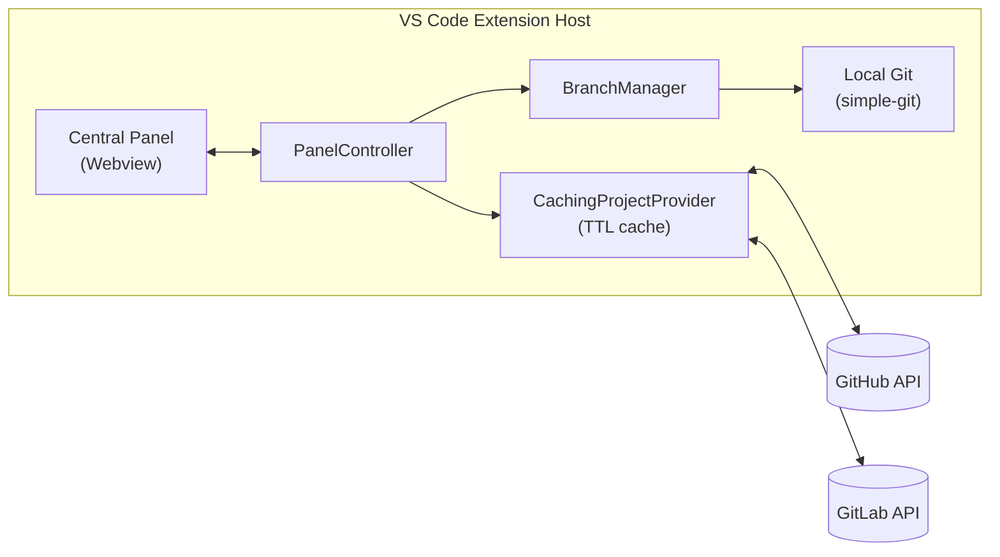

# Remote Project Manager

Manage GitHub and GitLab **Issues** and **Milestones** from a single panel inside VS Code — and automatically create a git branch when you start working on an issue.

> **New here?** Follow the [Getting Started guide](GETTING_STARTED.md) for a step-by-step walkthrough: install the extension, connect a repository, and use the panel — no prior knowledge needed.

## Overview

Remote Project Manager opens a central panel in the editor area where you can view, filter, edit, and update Issues and Milestones for a GitHub or GitLab repository. Changes made in the panel are written back to the remote platform in real time, respecting your account's actual permissions.

It also automates a common manual step: when an issue assigned to you moves to "in progress", the extension can create and check out a correctly named git branch for you, based on an up-to-date default branch.



## Key Features

- **Multi-provider support** — Works with GitHub and GitLab through a shared interface; switch providers per repository via settings.
- **Central panel UI** — List and edit Issues and Milestones side by side, with read-only fields automatically disabled when your account lacks write access.
- **Secure credential storage** — GitHub uses VS Code's built-in authentication provider (no token ever touches disk in our code); GitLab uses a Personal Access Token stored in VS Code's encrypted `SecretStorage`. See [Authentication and Security](docs/functionals/01-authentication-and-security.md).
- **Multi-root workspace detection** — Automatically detects the repository from your workspace's git remotes, and offers a picker when more than one is found.
- **Local caching** — Issue/milestone/capability reads are cached for a short, configurable time to avoid hitting API rate limits, with a manual "Refresh" button to bypass the cache.
- **Automated Git workflow** — Auto-creates a sanitized, conventionally named branch when an issue assigned to you starts "in progress," with safe handling of uncommitted changes. You can also trigger branch creation manually from an issue's detail pane, choosing the base branch yourself. See [Automated Branch Workflow](docs/functionals/03-automated-branch-workflow.md).
- **Filter issues by milestone** — Jump from a milestone's detail pane straight to its issues, pre-filtered.

## Quick Start / Installation

### Prerequisites

- VS Code 1.85 or later.
- [Node.js](https://nodejs.org/) 18 or later and `git` installed and on your `PATH` (required for the auto-branch feature).
- A GitHub or GitLab account with access to the repository you want to manage.

### Run from source (development)

```bash
npm install
npm run compile
```

Then press `F5` in VS Code to launch an Extension Development Host with the extension loaded.

### Install from a packaged build (`.vsix`)

VS Code's **Install from VSIX...** command (Extensions view → `...` menu → **Install from VSIX...**, or the `Extensions: Install from VSIX...` command in the Command Palette) always works — but you need a `.vsix` file first. Build one with:

```bash
npm run package
```

This compiles the extension and runs `vsce package`, producing `remote-project-manager-<version>.vsix` in the project root. Install that file via the command above.

### Connect a repository

1. Set `remoteProjectManager.repository` in your workspace settings (e.g. `"acme/widgets"`), **or** open a workspace whose git `origin` remote points at GitHub/GitLab — the extension detects it automatically.
2. Open the panel — click the **Remote Project Manager** icon in the Activity Bar, or run the **Remote Project Manager: Open Panel** command from the Command Palette.
3. On first use with GitHub, VS Code will prompt you to sign in (native GitHub auth). On first use with GitLab, you'll be prompted to paste a Personal Access Token.

See [Issues and Milestones Management](docs/functionals/02-issues-and-milestones-management.md) for panel usage details.

## Git & AI Automation Commands

Beyond the panel, the extension contributes commands (Command Palette) for a standardized, AI-friendly git workflow — Conventional Commits combined with Gitmoji, and structured context export for AI coding agents (Copilot Chat, Claude Code, Continue.dev, ...):

| Command                                                             | What it does                                                                                                                                                                                                                                |
| ------------------------------------------------------------------- | ------------------------------------------------------------------------------------------------------------------------------------------------------------------------------------------------------------------------------------------- |
| **Remote Project Manager: Compose Commit (Conventional + Gitmoji)** | Interactive flow (type, scope, Gitmoji, description, and an issue reference pre-filled from your current branch name) that writes the composed `<type>(<scope>): <gitmoji> <description>` message into the Source Control input box.        |
| **Remote Project Manager: Pick Gitmoji**                            | Standalone searchable Gitmoji picker — inserts the chosen emoji at the cursor, or copies it to the clipboard with no active editor.                                                                                                         |
| **Remote Project Manager: Copy Issue Context for AI**               | Copies the active issue's context (title, body, milestone, acceptance criteria) as Markdown to the clipboard, ready to paste into an AI assistant. Also exposed programmatically via this extension's exports as `getActiveIssueContext()`. |
| **Remote Project Manager: Create PR from Issue**                    | Opens a prefilled GitHub compare / GitLab merge-request URL built from the active issue, its commits ahead of the default branch, and its milestone.                                                                                        |
| **Remote Project Manager: Show Git Graph (by Issue)**               | Browse recent commits grouped by the issue they reference, via a QuickPick.                                                                                                                                                                 |
| **Remote Project Manager: Lint Commit History**                     | Flags commits in the last 100 that don't match the Gitmoji/Conventional Commit convention and offers a copyable suggested correction — never rewrites history automatically.                                                                |
| **Remote Project Manager: Export Milestone Context for AI Agents**  | Writes the active milestone's context (and its issues) to a Markdown file (default `.github/copilot-instructions.md`, configurable via `remoteProjectManager.aiContextFile`), replacing only its own managed section on re-export.          |

The "active issue" for these commands is resolved from your current branch name (matching `${issue_id}` in `remoteProjectManager.branchNamePattern`), falling back to a picker when it can't be determined.

## Extension Settings

| Setting                                       | Type                   | Default                             | Description                                                                                                                                                                        |
| --------------------------------------------- | ---------------------- | ----------------------------------- | ---------------------------------------------------------------------------------------------------------------------------------------------------------------------------------- |
| `remoteProjectManager.provider`               | `"github" \| "gitlab"` | `"github"`                          | Remote platform to connect to. Ignored when the repository is auto-detected from a git remote.                                                                                     |
| `remoteProjectManager.repository`             | `string`               | `""`                                | Repository or project path, e.g. `"owner/repo"`. Leave empty to auto-detect from the workspace's git remotes.                                                                      |
| `remoteProjectManager.gitlabHost`             | `string`               | `""`                                | Hostname of a self-hosted GitLab instance (e.g. `"gitlab.example.com"`), used to both auto-detect repositories on that host and connect to its API. Leave empty to use gitlab.com. |
| `remoteProjectManager.cacheTtlSeconds`        | `number`               | `180`                               | How long issue/milestone/capability reads are cached before refetching, in seconds. Use the panel's Refresh button to bypass the cache immediately.                                |
| `remoteProjectManager.autoBranchOnInProgress` | `boolean`              | `true`                              | Automatically create and check out a git branch when an issue assigned to you moves to "in progress." When off, a suggested branch name is shown instead.                          |
| `remoteProjectManager.branchNamePattern`      | `string`               | `"${type}/${issue_id}-${slug}"`     | Pattern for auto-created branch names. Placeholders: `${type}` (inferred from labels), `${issue_id}` (issue number), `${slug}` (sanitized title).                                  |
| `remoteProjectManager.aiContextFile`          | `string`               | `".github/copilot-instructions.md"` | Workspace-relative path **Export Milestone Context for AI Agents** writes to. Only the extension-managed section is replaced on re-export; the rest of the file is left untouched. |

## Documentation

New to the extension? Start with [Getting Started](GETTING_STARTED.md). Deep-dive functional guides live in [`docs/functionals/`](docs/functionals/INDEX.md):

- [01 — Authentication and Security](docs/functionals/01-authentication-and-security.md)
- [02 — Issues and Milestones Management](docs/functionals/02-issues-and-milestones-management.md)
- [03 — Automated Branch Workflow](docs/functionals/03-automated-branch-workflow.md)
- [04 — Troubleshooting and FAQ](docs/functionals/04-troubleshooting-and-faq.md)

Architectural Decision Records live in [`docs/adr/`](docs/adr/).

Want to contribute code? See [CONTRIBUTING.md](CONTRIBUTING.md) for the dev workflow.
