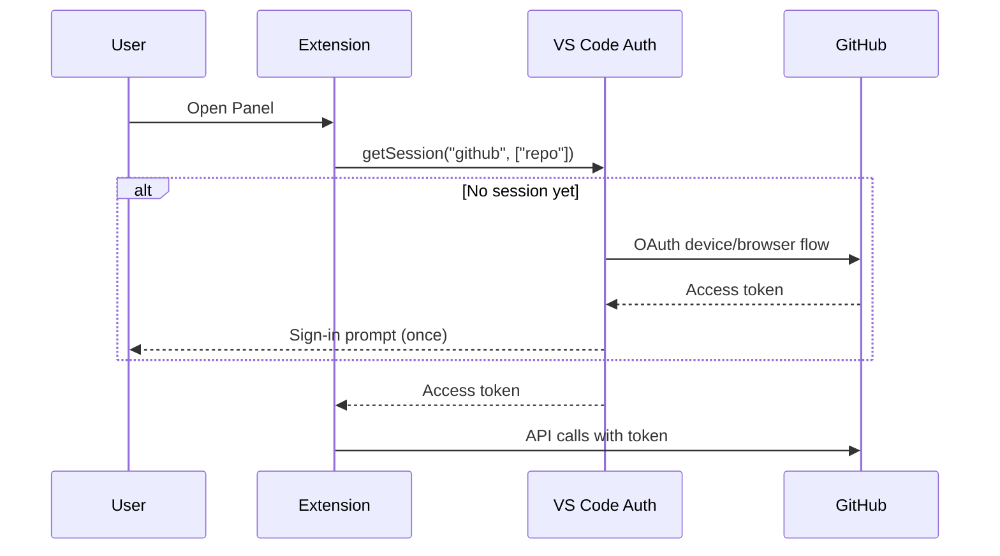

# Authentication and Security

This guide explains how Remote Project Manager authenticates to GitHub and GitLab, and how it keeps your credentials safe.

## How Authentication Works

The extension uses a different method per provider, chosen to be as secure as each platform allows.

### GitHub: native VS Code authentication

GitHub uses VS Code's built-in GitHub authentication provider:

- The extension calls `vscode.authentication.getSession('github', ['repo'], { createIfNone: true })`.
- VS Code owns the OAuth session end to end: the sign-in flow, token refresh, and secure storage.
- The extension's code never reads, stores, or persists the raw GitHub token itself. It only holds it in memory for the duration of API calls made through Octokit.
- Because the requested scope is `repo`, the token can read and write issues on both public and private repositories you have access to.

### GitLab: Personal Access Token in SecretStorage

GitLab has no built-in VS Code authentication provider, so the extension asks for a Personal Access Token (PAT) the first time you connect:

1. You run **Remote Project Manager: Open Panel** with `remoteProjectManager.provider` set to `gitlab` (or a workspace whose git remote points at `gitlab.com`).
2. An input box asks for a PAT (masked as you type).
3. The token is written to VS Code's `SecretStorage` (`context.secrets`), keyed per provider.
4. On every later use, the token is read back from `SecretStorage` — you are not asked again unless you clear it.

Recommended GitLab PAT scopes:

| Scope | Needed for |
|---|---|
| `api` | Full read/write access to issues and milestones (recommended). |
| `read_api` | Read-only. Use this if you only want to view issues/milestones, not edit them. |

## Security Practices

- **No plaintext storage, ever.** Tokens are never written to `globalState`, `workspaceState`, `.vscode/settings.json`, or any other file. The only two places a token can live are: VS Code's own GitHub session store, or `SecretStorage` for GitLab.
- **Minimum viable scope.** Request only the scopes you need. If you only need to read issues, use a `read_api` GitLab token — the extension respects the account's actual permissions and disables editing in the panel when write access isn't available (see [Issues and Milestones Management](02-issues-and-milestones-management.md)).
- **Tokens are provider-scoped.** GitHub and GitLab tokens are stored under separate keys; switching `remoteProjectManager.provider` never mixes them up.
- **Rotate compromised tokens immediately.** If a GitLab PAT is compromised, revoke it on GitLab's side — the extension will simply prompt for a new one on the next connection attempt, since `SecretStorage` no longer has a valid one once you clear it (see [Troubleshooting](04-troubleshooting-and-faq.md#resetting-a-stored-gitlab-token)).
- **No credentials in logs.** The extension never logs token values; error messages surfaced to the UI only ever include HTTP status/messages from the API client, never request headers.

## What the Extension Can and Cannot Do

| Capability | GitHub | GitLab |
|---|---|---|
| Read issues/milestones | Governed by the `repo` scope's read access | Governed by your PAT scope and project role |
| Write issues/milestones | Governed by the `repo` scope's write access and your repo permissions | Requires **Developer** role or higher on the project |
| Detect read/write capability automatically | Yes (`getCapabilities()`) | Yes (`getCapabilities()`) |

The panel calls `getCapabilities()` on load and disables editing controls in the UI when your account is read-only — you'll never see a "successful" edit silently fail due to missing permissions.
