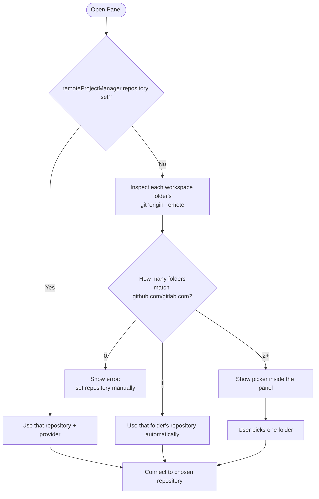

# Issues and Milestones Management

This guide covers the central panel: how to open it, how repository detection works in multi-root workspaces, and how to view and edit Issues and Milestones.

## Opening the Panel

Run **Remote Project Manager: Open Panel** from the Command Palette (`Cmd/Ctrl+Shift+P`). The panel opens as an editor tab, so it sits alongside your code instead of in a sidebar.

## Repository Detection and Multi-Root Workspaces

The extension resolves which repository to connect to in this order:

- **Explicit setting wins.** If `remoteProjectManager.repository` is set, it's used as-is — no git inspection happens.
- **Single match is automatic.** In a single-root workspace (or a multi-root workspace where only one folder has a GitHub/GitLab remote), the panel connects immediately.
- **Multiple matches show a picker.** When more than one workspace folder resolves to a recognized repository, the panel itself renders a list — pick one before any provider connection or token request happens. This means switching between repositories in a multi-root workspace costs nothing until you actually need to.
- **Supported remotes:** `github.com` and `gitlab.com`, over SSH (`git@host:owner/repo.git`), `ssh://`, or `https://` URLs, with or without a trailing `.git`. A self-hosted GitLab instance is also recognized once `remoteProjectManager.gitlabHost` is set to its hostname (e.g. `gitlab.example.com`); otherwise set `remoteProjectManager.repository` manually for those.

## Viewing Issues and Milestones

The panel has two tabs, **Issues** and **Milestones**, each with a list on the left and a detail/edit pane on the right:

- Click any item in the list to load its details.
- Closed items are shown with strikethrough text in the list.
- An issue's labels are shown as badges in its detail pane. The edit form does not expose a labels field (see [Moving an Issue to "In Progress"](#moving-an-issue-to-in-progress) for how to add one).
- A **Refresh** button in the toolbar forces an immediate refetch from the remote, bypassing the local cache (see [Troubleshooting](04-troubleshooting-and-faq.md#rate-limiting-and-caching) for how caching works).

### Filtering Issues by Milestone

A milestone's detail pane shows a **View issues** button next to its open/closed count. Clicking it switches to the Issues tab, filtered to only that milestone's issues. The filter is cleared by clicking the **Issues** tab again.

## Editing

For an issue, you can edit:

| Field | Notes                                                                        |
| ----- | ---------------------------------------------------------------------------- |
| Title | Free text.                                                                   |
| State | `Open` or `Closed`.                                                          |
| Body  | Free text (Markdown supported by the remote platform, not rendered locally). |

For a milestone, you can edit:

| Field       | Notes               |
| ----------- | ------------------- |
| Title       | Free text.          |
| State       | `Open` or `Closed`. |
| Description | Free text.          |

Click **Save** to push the change to GitHub/GitLab. On success, the panel refetches and shows the updated list and detail immediately.

An issue's detail pane also has a **Create branch** button, letting you trigger the branch-creation workflow manually and pick the base branch yourself — see [Manual Branch Creation](03-automated-branch-workflow.md#manual-branch-creation-from-the-issue-detail-pane).

### Read-Only Mode

If your account does not have write access to issues or milestones on the connected repository, every input field and the **Save** button are disabled, and a note explains why. This is determined by the provider's own permission model (GitHub repo permissions, GitLab project access level), fetched once per session and re-checked before every write attempt — you will never lose an edit to a silent permission failure.

## Moving an Issue to "In Progress"

There is no dedicated "in progress" state on GitHub or GitLab — the extension treats an issue as "in progress" when it has the `in-progress` label. The panel's edit form does not currently expose a labels field, so add the `in-progress` label directly on GitHub or GitLab (or via their API/CLI). The next time the panel refetches that issue — after a Refresh, or after any edit you make in the panel — the extension detects the label was added and triggers the automated branch workflow described in [Automated Branch Workflow](03-automated-branch-workflow.md).
