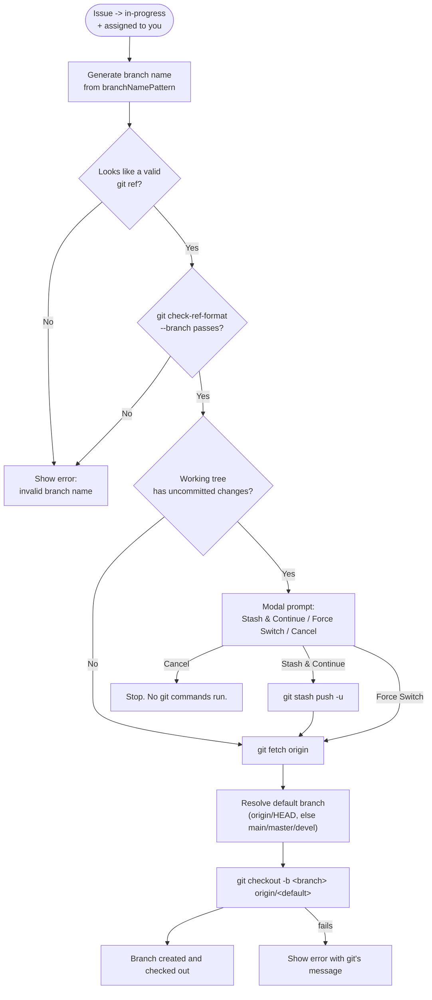

# Automated Branch Workflow

This guide covers how Remote Project Manager automatically creates and checks out a git branch when you start working on an issue.

## When It Triggers

Auto-branch creation fires when **all** of these are true:

1. An issue's labels change to include `in-progress` (detected on the panel's next state refresh — see [Issues and Milestones Management](02-issues-and-milestones-management.md#moving-an-issue-to-in-progress)).
2. You are one of that issue's assignees — matched against the currently authenticated GitHub/GitLab username, case-insensitively.
3. `remoteProjectManager.autoBranchOnInProgress` is `true` (the default).
4. The repository maps to a workspace folder VS Code knows the path of (true for auto-detected repositories; also true for an explicit `remoteProjectManager.repository` setting, as long as a workspace folder is open).

If condition 2 fails (the issue is assigned to someone else), nothing happens — the extension never creates branches on your behalf for a teammate's work. If condition 3 or 4 fails, you instead see an information message suggesting the branch name, so you can create it yourself.

## The Safety Sequence

### Uncommitted Changes

If your working tree has uncommitted changes when the trigger fires, a modal dialog asks how to proceed:

| Choice               | What happens                                                                                                                                                                                                                              |
| -------------------- | ----------------------------------------------------------------------------------------------------------------------------------------------------------------------------------------------------------------------------------------- |
| **Stash & Continue** | Runs `git stash push -u` (includes untracked files), then continues. Recover your changes later with `git stash pop`.                                                                                                                     |
| **Force Switch**     | Skips stashing and proceeds straight to fetch/checkout. Git will carry compatible uncommitted changes onto the new branch, or fail with a conflict error if it can't — the extension surfaces that error rather than discarding anything. |
| **Cancel**           | Stops immediately. No git command runs at all.                                                                                                                                                                                            |

### Basing the Branch on an Up-to-Date Default

Before checking out the new branch, the extension always runs `git fetch origin` and bases the branch on `origin/<default>` — never on your local default branch, which might be behind. The default branch is resolved by:

1. Reading `refs/remotes/origin/HEAD` (the remote's actual default branch).
2. If that's unavailable, checking for `main`, then `master`, then `devel` on `origin`, in that order.

If none of those exist, branch creation fails with a clear error instead of guessing.

## Branch Name Pattern

Configure `remoteProjectManager.branchNamePattern` (default: `${type}/${issue_id}-${slug}`). Three placeholders are supported:

| Placeholder   | Meaning                                             | Example               |
| ------------- | --------------------------------------------------- | --------------------- |
| `${type}`     | Inferred from the issue's labels (see table below). | `fix`                 |
| `${issue_id}` | The issue number.                                   | `42`                  |
| `${slug}`     | Sanitized issue title.                              | `panel-does-not-open` |

Example: issue #42, titled "Panel does not open", labeled `bug`, with the default pattern produces `fix/42-panel-does-not-open`.

### Type Inference from Labels

| Label (case-insensitive) | `${type}` |
| ------------------------ | --------- |
| `bug`                    | `fix`     |
| `enhancement`            | `feature` |
| `feature`                | `feature` |
| `documentation`          | `docs`    |
| `docs`                   | `docs`    |
| `chore`                  | `chore`   |
| _(no matching label)_    | `issue`   |

### Slug Sanitization Rules

The title is converted to a slug by, in order:

1. **Unicode normalization (NFKD)** to split accented characters into a base letter plus a combining mark, then **stripping the combining marks** — so `é` becomes `e`, not a dropped or mangled character.
2. **Lowercasing** everything.
3. **Replacing every run of non-alphanumeric characters** (spaces, punctuation, emoji, symbols) **with a single hyphen**.
4. **Trimming** leading/trailing hyphens.
5. **Truncating** to 50 characters, then trimming any trailing hyphen left by the cut.

If the title has no usable characters left after sanitization (e.g. a title that's only emoji or punctuation), the `-${slug}` portion is dropped from the pattern entirely — you get `fix/42` instead of a dangling `fix/42-`.

### Validation

Before ever touching git, the generated name is checked twice:

1. A fast, local pre-check (`looksLikeValidGitRef`) rejects spaces, `..`, `~^:?*[]\`, leading/trailing dots or slashes, and a trailing `.lock` — the most common problems, checked without spawning a process.
2. The authoritative check: `git check-ref-format --branch <name>`, git's own validator.

If either check fails, you see an error naming the invalid branch and pointing at `remoteProjectManager.branchNamePattern` — no git command that could touch your working tree runs.

## Manual Branch Creation from the Issue Detail Pane

Besides the automatic trigger above, you can create a branch for any issue on demand: open the issue's detail pane and click **Create branch**.

1. The extension runs `git fetch origin` under a progress notification ("Fetching branches from origin…"), then lists `origin`'s branches in a search-select quick pick titled **Base branch**. `main`/`master` (`main` winning if both exist) is placed first so it's focused by default; picking Escape/Cancel aborts with no git command run.
2. Once you pick a base branch, the same [safety sequence](#the-safety-sequence) as the automatic workflow runs — name generation and validation, the dirty-working-tree prompt if needed, then `git checkout -b <branch> origin/<chosen base>` instead of the auto-resolved default.

This is the way to base a new branch on something other than the repository's default (a release branch, another feature branch, etc.), and it works regardless of the `remoteProjectManager.autoBranchOnInProgress` setting.

## Turning It Off

Set `remoteProjectManager.autoBranchOnInProgress` to `false` to disable automatic checkout. The extension still detects the "in-progress" transition on issues assigned to you and shows an information message with the branch name it would have used, so you can create it manually.
